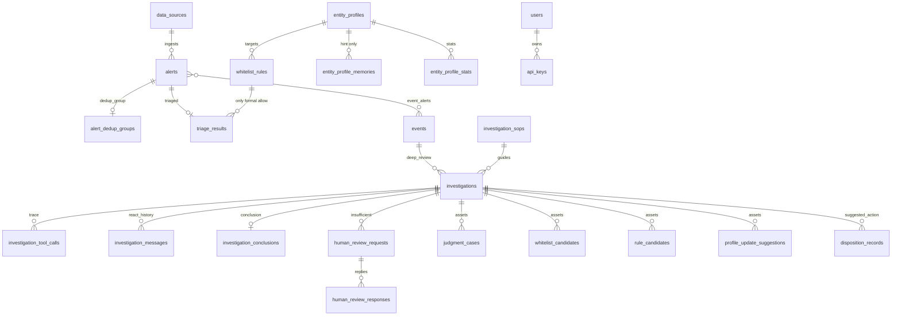
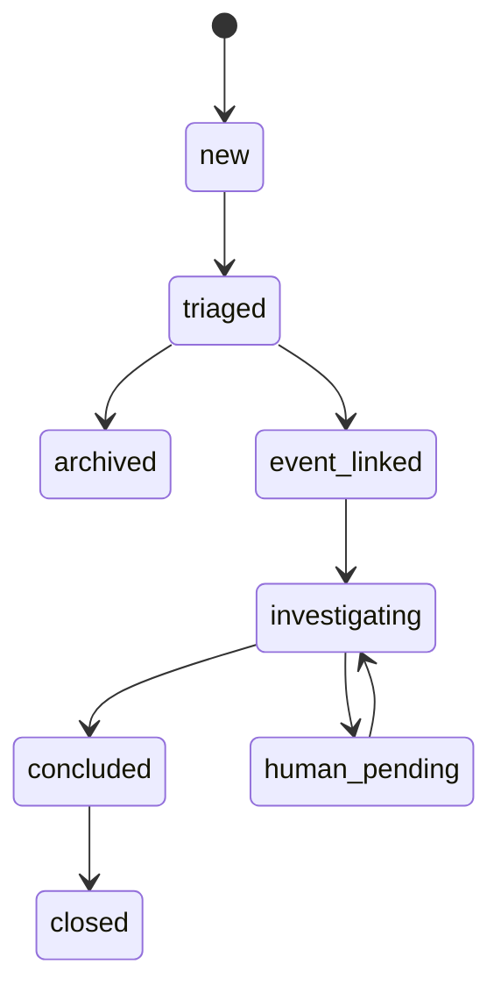

# 数据库 ER 设计（阶段 1 定稿）

> 单租户：每台 ECS 一套实例，无 `tenant_id`。  
> 事件聚合键：**host + user + category + 24h 窗口**（Option B）。  
> 判例检索：GIN + `entity_tags` JSONB；`judgment_cases.embedding` 预留 nullable（阶段 7 迁移 pgvector）。

## 总体 ER 图



## 表清单（34 张）

| # | 表名 | 域 | 方法论要点 |
|---|------|-----|-----------|
| 1 | `data_sources` | 接入 | 多源可插拔 |
| 2 | `alert_dedup_groups` | 接入 | 初筛去重（量） |
| 3 | `alerts` | 接入 | `raw_data` 全量保留 |
| 4 | `triage_results` | 初筛 | 只路由，非最终结论 |
| 5 | `whitelist_rules` | 初筛 | **唯一可自动归档** |
| 6 | `whitelist_candidates` | 初筛/沉淀 | ≥3 次确认升格 |
| 7 | `entity_profiles` | 画像 | 资产上下文 |
| 8 | `entity_profile_memories` | 画像 | **不可放行** |
| 9 | `entity_profile_stats` | 画像 | 7/30/90 天实时统计 |
| 10 | `on_duty_knowledge` | 画像 | 值班/现场知识 |
| 11 | `threat_intel_entries` | 画像 | 中间证据，非结论 |
| 12 | `events` | 聚合/复核 | 调查单元 + 聚合维度 |
| 13 | `event_alerts` | 聚合/复核 | M:N 关联 |
| 14 | `investigation_sops` | Agent | 指导原则，非死步骤 |
| 15 | `investigations` | Agent | token/Skill 成本追踪 |
| 16 | `investigation_tool_calls` | Agent | 完整 Skill 轨迹 |
| 17 | `investigation_conclusions` | Agent | 结构化复核结论 |
| 18 | `investigation_messages` | Agent | ReAct 全量落库 |
| 19 | `human_review_requests` | 人工 | IM 协查 outbound |
| 20 | `human_review_responses` | 人工 | 回调 inbound |
| 21 | `audit_samples` | 人工 | 环上抽检 |
| 22 | `judgment_cases` | 沉淀 | 完整 trace + embedding 预留 |
| 23 | `rule_candidates` | 沉淀 | 检测规则候选 |
| 24 | `profile_update_suggestions` | 沉淀 | 画像更新建议 |
| 25 | `disposition_records` | 沉淀 | 建议 vs 确认处置 |
| 26 | `cache_entries` | 支撑 | 强缓存/中间证据/必须重判 |
| 27 | `regression_test_cases` | 支撑 | 回归样本 |
| 28 | `regression_test_runs` | 支撑 | 批量回归结果 |
| 29 | `health_check_scenarios` | 支撑 | 链路探针场景 |
| 30 | `health_check_runs` | 支撑 | 探针执行记录 |
| 31 | `users` | 系统 | 控制台账号 |
| 32 | `api_keys` | 系统 | API 认证 |
| 33 | `audit_logs` | 系统 | 全局审计 |
| 34 | `system_config` | 系统 | 可配置阈值 |

## 关键约束（代码层必须 enforce）

### 1. 画像记忆 vs 白名单规则

```
entity_profile_memories  →  仅影响 triage_results.profile_hint_score
whitelist_rules (active) →  才允许 route_decision = archive_whitelist
```

`triage_results.whitelist_rule_id` 非空是归档放行的**必要条件**。

### 2. 事件聚合键（Option B）

```text
event_key = hash(host_name, user_name, alert_category, window_start)
window_start = floor(occurred_at, 24h)   # 可配置，默认 24
```

对应字段：`events.aggregate_host_name`, `aggregate_user_name`, `aggregate_category`, `aggregate_window_start`。

建议写入 `system_config`：

```json
{
  "event.aggregation_window_hours": 24,
  "triage.deep_review_threshold": 70,
  "triage.sample_audit_rate": 0.01
}
```

### 3. 缓存类型（`cache_entries.cache_type`）

| 枚举值 | 含义 | 示例键 |
|--------|------|--------|
| `strong_conclusion` | 可复用最终结论 | `conclusion:v1:{sha256}` |
| `intermediate_evidence` | 只缓存查询结果 | `asset:v1:{ip}` |
| `must_rejudge` | 禁止复用结论 | 默认策略 |

### 4. Agent 结论枚举

`investigation_conclusions.verdict`:

- `attack_confirmed`
- `likely_false_positive`
- `insufficient_information` → 触发 `human_review_requests`
- `needs_human_review`

## 告警状态机



## 目录结构

```text
app/
  db/
    base.py          # Base, mixins
    enums.py         # 全部枚举
    session.py       # async session
  models/
    ingestion.py     # data_sources, alerts, alert_dedup_groups
    triage.py        # triage_results, whitelist_*
    entity.py        # 画像三件套 + 情报 + 值班知识
    investigation.py # events, investigations, messages, ...
    human_review.py
    defense_assets.py
    cache_eval.py
    system.py
alembic/versions/001_initial_schema.py
```

## 迁移命令

```bash
alembic upgrade head    # 创建全部表
alembic downgrade base  # 回滚（开发环境）
```

## 阶段 7 预留

`judgment_cases.embedding` 当前为 `FLOAT[]` nullable；启用 pgvector 后迁移为 `VECTOR(1536)` 并建 HNSW/IVFFlat 索引。
